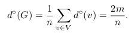
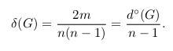

# Large Networks of Interactions
Study of the Large Networks of Interactions and graphs from real contexts.  
Examples:  
- Graphs of the Web
- Internet Topologies
- Social Networks
- Biological Networks 

## Data
### Rappel:
A graph G = (V, E) is a pair of sets.  
* V is the set of nodes.
* E ⊆ (V × V) is the set of links.  

We denote n = | V | the number of nodes and m = | E | the number of links.  
Two nodes u and v are neighbors if there is a link between u and v.  
The degree of a node v, denoted ◦ d (v) is the number of neighbors.  
The average degree of the graph is the average degree on all nodes :  
  

The density of a graph is the number of links compared with the number of links possible between all pairs of nodes :  
  

### Graph Files
Graph files are simple text files. The graph is represented by line of the form :  
```
n1 n2
```
which indicate that there is a link between nodes n1 and n2.  

Example:
For this graph :  
  
The data file is :  
[graph.data](graph.data)  

<!--
## Stockage en mémoire
Deux façons principales de stocker un graphe en mémoire :
– matrice d’adjacence
– listes d’adjacence
Exemples. Avantages et inconvénients : temps pour savoir si un lien existe,
pour calculer le degré d’un nœud. Taille des deux représentations.
En pratique, nos graphes sont peu denses (m ∈ O(n)).  

## Distributions homogènes vs hétérogènes
En pratique, on a deux grandes familles de distributions :
– les distributions homogènes sont bien centrées autour de la moyenne
(exemple : taille des gens)
– les distributions hétérogènes ont beaucoup de petites valeurs, quelques
très grandes valeurs, et tous les comportements entre les deux (exemple :
salaires).
Les distributions hétérogènes ressemblent souvent à des lois de puissances :
y ∼ x−α
−→ droites en échelle log-log.  

Dans les distributions homogènes, la moyenne est représentative : la plupart
des valeurs sont proches de la moyenne.
Dans les distributions hétérogènes, la moyenne n’est pas représentative : la
plupart des valeurs sont au-dessous de la moyenne, et quelques unes sont très
au-dessus de la moyenne.

## Distribution des degrés
Dans les graphes issus de contextes réels, la distribution des degrés est la
plupart du temps hétérogène
−→ le degré moyen n’est pas représentatif.  
-->


